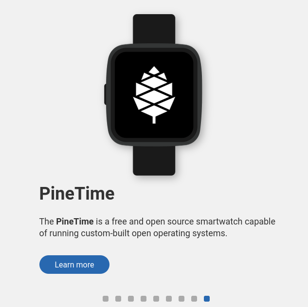
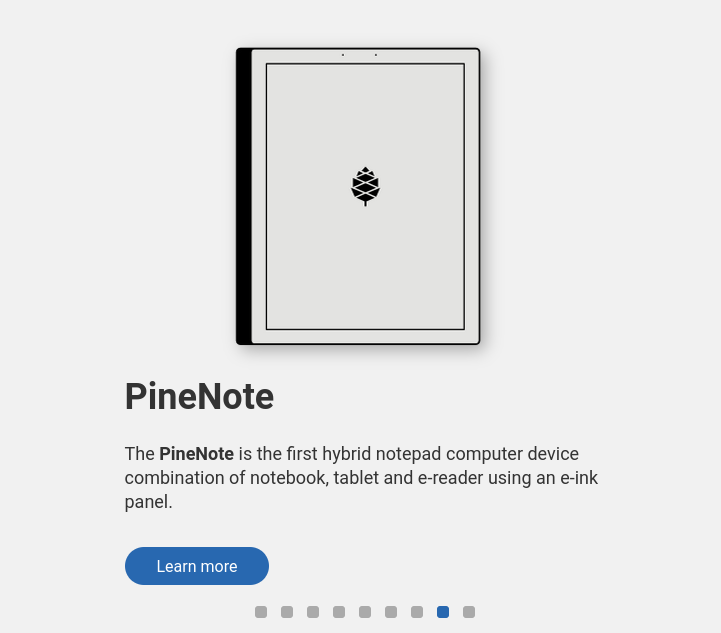
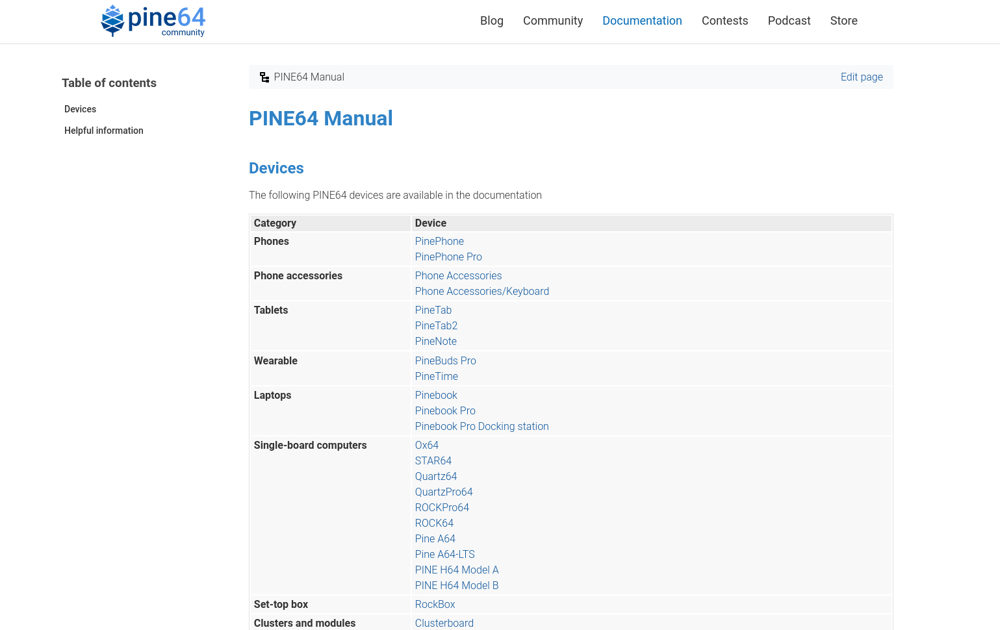

PineTab2 and PineTab-V releases, https://wiki.pine64.org/wiki/PineTab2_Releases and https://wiki.pine64.org/wiki/PineTab-V_Releases (and work by Icenowy?)

## Rework of the community website and logo

If you missed the announcement, an initial rework of the community website was announced. The announcement blog post can be read exclusively on the new beta site: https://beta.pine64.org/2023/04/13/a_new_design/

The overall idea of the reworked community website is to move away from a WordPress site and to open up the site to contributions from all community members. This is done by hosting the website on Git and by generating the contents using the blazing-fast framework *Hugo*. Large parts of the website are created from simple markdown files, which are easy to understand and to edit. Alongside the rework of the community website, there was also a challenge launched, which has the goal of improving the appearance of the community logo. The details can be read under https://beta.pine64.org/contests/the-logo-challenge/. Bring in your best ideas if you haven't done so yet. Ideas are best submitted to https://github.com/pine64/website/issues/12.

Since the last blog post, there has been various improvements made to the beta community website. The improvements include changes to the style of various sites, improvements to the front site slider and inclusion of more slides, rewrite of pages as markdown files (such as the index page), creation of more board graphics and many more changes.




The documentation for all PINE64 devices is also constantly improving. While there are large construction zones left, the overall look of the documentation is already quite clean and constantly improving:



It is worth to note that the changes are not visible under https://beta.pine64.org yet but they can be viewed on the repository under https://github.com/pine64/website. Give it a try by cloning the repository and previewing the page using Hugo:

```
git clone https://github.com/pine64/website.git
cd website
hugo server
```

## Various honorable mentions and software progress

Aside from the main news, many developers and community members have been busy contributing their code and work. This section serves as a brief overview of a selection of projects and news within the recent past.

### Progress on the PineTab2 and PineTab-V

Since the PineTab2 and PineTab-V tablets have been shipped, the community has been tirelessly at work, propelling the software landscape forward and unveiling an array of new software and bootable images for both tablet models.

The [software releases section of the PineTab2](https://wiki.pine64.org/wiki/PineTab2_Releases) already lists Arch Linux ARM, Mobian, NixOS, postmarketOS, Rhino Linux, Ubuntu Touch and others, with more to come. The [software releases section of the PineTab-V](https://wiki.pine64.org/wiki/PineTab-V_Releases) lists a Gentoo overlay, as well as a KDE Plasma Yocto build from the community member Fishwaldo, with even more in the pipeline.

There is also progress on the WiFi driver of the PineTab2. Some releases already ship with an initial support for the on-board WiFi chip. It is however important to note that the work on the driver is ongoing and has not reached a software maturity yet. 

These software releases are a testament to the vibrant collaboration within the PINE64 community. Developers, enthusiasts, and users alike have come together to cultivate a thriving ecosystem that empowers PineTab2 and PineTab-V users with an array of choices. 

### A PinePhone Pro connected to a thermal imaging camera

The user *yomboprime* coupled a PinePhone Pro with the thermal imaging camera Topdon TC-001. Check out their nice video here: https://www.youtube.com/watch?v=lJhgZve9xSA

### Oren Klopfer's progress on Ubuntu Touch

Another mention deserves maintainer Oren Klopfer, who is working on Ubuntu Touch support on numerous devices, including the PinePhone and PinePhone Pro, the PineTab and PineTab2.

Check out the supported devices under https://devices.ubuntu-touch.io/.
