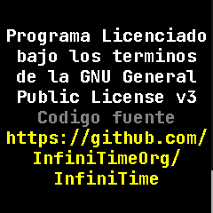
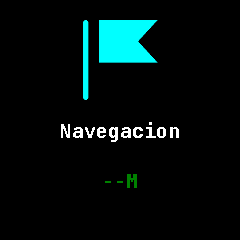

# PineTime

- User [CansecoGPC](https://github.com/CansecoGPC) builds a [translated version of InfiniTime in Spanish](https://github.com/CansecoGPC/InfiniTime-es) named **InfiniTime-es**. The [Spanish version of InfiniTime 1.13](https://github.com/CansecoGPC/InfiniTime-es/releases/tag/spanish) is available.

    

- A nice article about the PineTime, InfiniTime and WaspOS on LWN : [PineTime: a smartwatch for open-source software](https://lwn.net/Articles/941796/). The article will be available for free without subscription from August 31.
